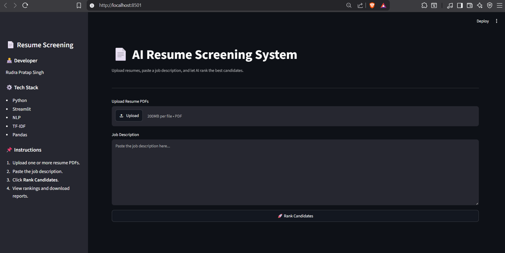
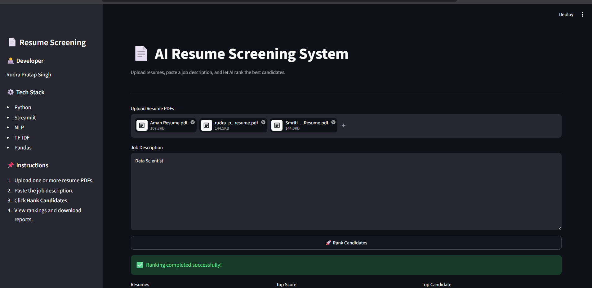
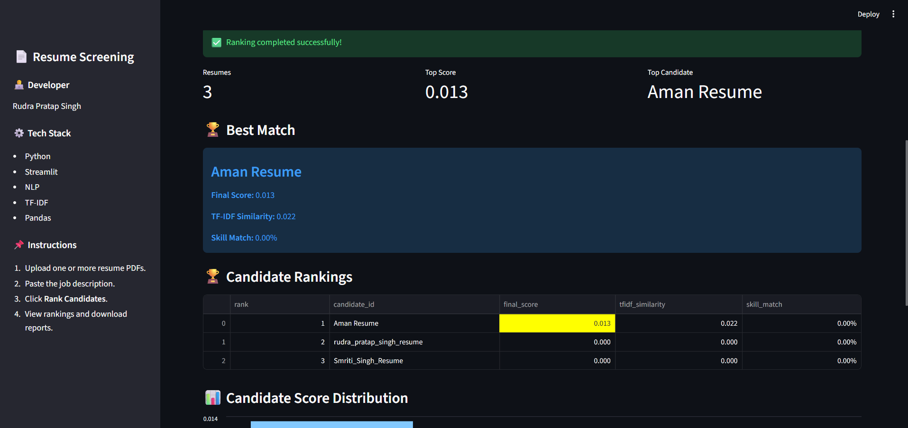
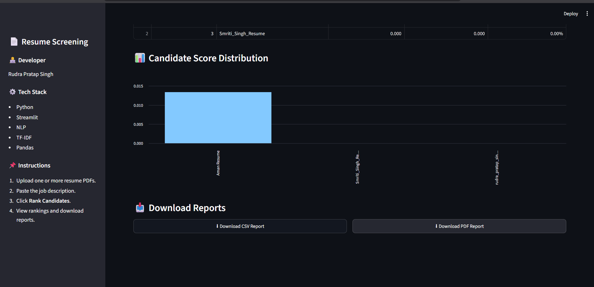

# 📄 AI Resume Screening System

> An AI-powered Resume Screening System that ranks candidates against a job description using Natural Language Processing (NLP), TF-IDF similarity, and skill matching.


---
## 📸 Project Preview

### 🏠 Home Screen



---

### 📤 Resume Upload



---

### 📊 Results Dashboard



---

### 📥 Download Reports



---

## 📖 About the Project

Recruiters often receive hundreds of resumes for a single job opening, making manual screening time-consuming and inconsistent. This project automates the initial screening process by analyzing resumes against a given job description.

The system combines **Natural Language Processing (NLP)**, **TF-IDF similarity**, and **skill matching** to evaluate how well each candidate aligns with the required role. It then generates a ranked list of candidates along with downloadable CSV and PDF reports, helping recruiters identify the most relevant applicants more efficiently.

This project was developed as a practical demonstration of applying NLP techniques to solve a real-world recruitment problem while providing an intuitive web interface using Streamlit.

---

## ✨ Features

- 📄 Upload multiple resume PDFs for screening.
- 📝 Paste any job description directly into the application.
- 🤖 Automatic resume analysis using Natural Language Processing (NLP).
- 🔍 TF-IDF similarity scoring between resumes and the job description.
- 🎯 Skill matching based on extracted technical skills.
- 🏆 Candidate ranking based on a weighted scoring system.
- 📊 Interactive dashboard with key metrics and score visualization.
- 📈 Candidate score distribution chart.
- 📥 Download ranked candidate reports in both **CSV** and **PDF** formats.
- ⚡ Fast, interactive, and user-friendly Streamlit interface.

---

## 🛠️ Tech Stack

| Category | Technologies |
|----------|--------------|
| **Programming Language** | Python 3.11 |
| **Frontend** | Streamlit |
| **Natural Language Processing** | NLTK, spaCy |
| **Machine Learning** | Scikit-learn (TF-IDF, Cosine Similarity) |
| **Data Processing** | Pandas, NumPy |
| **PDF Processing** | PyPDF2 |
| **Visualization** | Streamlit Charts |
| **Reporting** | CSV, PDF (ReportLab) |

---

## 📂 Project Structure

```text
AI-RESUME-SCREENING-SYSTEM/
│
├── assets/                 # README images and screenshots
├── config/                 # Configuration files
├── data/
│   ├── raw/                # Input resumes
│   └── processed/          # Processed data
├── docs/                   # Project documentation
├── frontend/               # Frontend-related files (if any)
├── logs/                   # Pipeline execution logs
├── models/                 # Saved models / artifacts
├── notebooks/              # Experimentation notebooks
├── outputs/                # Generated CSV and PDF reports
├── scripts/                # Utility scripts
├── src/
│   ├── preprocessing/
│   ├── extraction/
│   ├── matching/
│   ├── ranking/
│   ├── reporting/
│   └── pipeline/
├── tests/                  # Unit tests
├── app.py                  # Streamlit application
├── requirements.txt
└── README.md
```

---

## ⚙️ Installation

### 1️⃣ Clone the Repository

```bash
git clone https://github.com/YOUR_USERNAME/AI-Resume-Screening-System.git
cd AI-Resume-Screening-System
```

### 2️⃣ Create a Virtual Environment

```bash
python -m venv venv
```

### 3️⃣ Activate the Virtual Environment

**Windows**

```bash
venv\Scripts\activate
```

**Linux / macOS**

```bash
source venv/bin/activate
```

### 4️⃣ Install Dependencies

```bash
pip install -r requirements.txt
```

### 5️⃣ Launch the Application

```bash
streamlit run app.py
```

The application will open automatically in your browser.

---

## ▶️ Usage

1. Launch the Streamlit application:

```bash
streamlit run app.py
```

2. Upload one or more resume PDFs.

3. Paste the job description into the text area.

4. Click **🚀 Rank Candidates**.

5. Review the following outputs:
   - 🏆 Best Matching Candidate
   - 📊 Candidate Rankings
   - 📈 Score Distribution Chart

6. Download the generated reports:
   - 📄 Ranked Candidates (CSV)
   - 📄 Ranked Candidates (PDF)

---

## 🚀 Future Improvements

Some enhancements planned for future versions include:

- 🔐 User authentication and role-based access (Admin / Recruiter).
- ☁️ Cloud deployment with Docker and CI/CD pipelines.
- 🤖 Integration with Large Language Models (LLMs) for semantic resume analysis.
- 📧 Automated email notifications to shortlisted candidates.
- 📊 Advanced analytics dashboard with hiring insights and trends.
- 🌍 Multi-language resume support.
- 📁 Direct integration with Applicant Tracking Systems (ATS).

---

## 👨‍💻 Author

**Rudra Pratap Singh**

🎓 B.Tech Computer Science & Engineering  

- 💼 LinkedIn: https://www.linkedin.com/in/rudra-pratap-singh-017a2a295/
- 💻 GitHub: https://github.com/Rudra01a
- 📧 Email: rudrasingh01a@gmail.com

---

⭐ If you found this project useful, consider giving it a star!

## 📑 Table of Contents

- [📸 Project Preview](#-project-preview)
- [📖 About the Project](#-about-the-project)
- [✨ Features](#-features)
- [🛠️ Tech Stack](#️-tech-stack)
- [📂 Project Structure](#-project-structure)
- [⚙️ Installation](#️-installation)
- [▶️ Usage](#️-usage)
- [🚀 Future Improvements](#-future-improvements)
- [👨‍💻 Author](#-author)

---